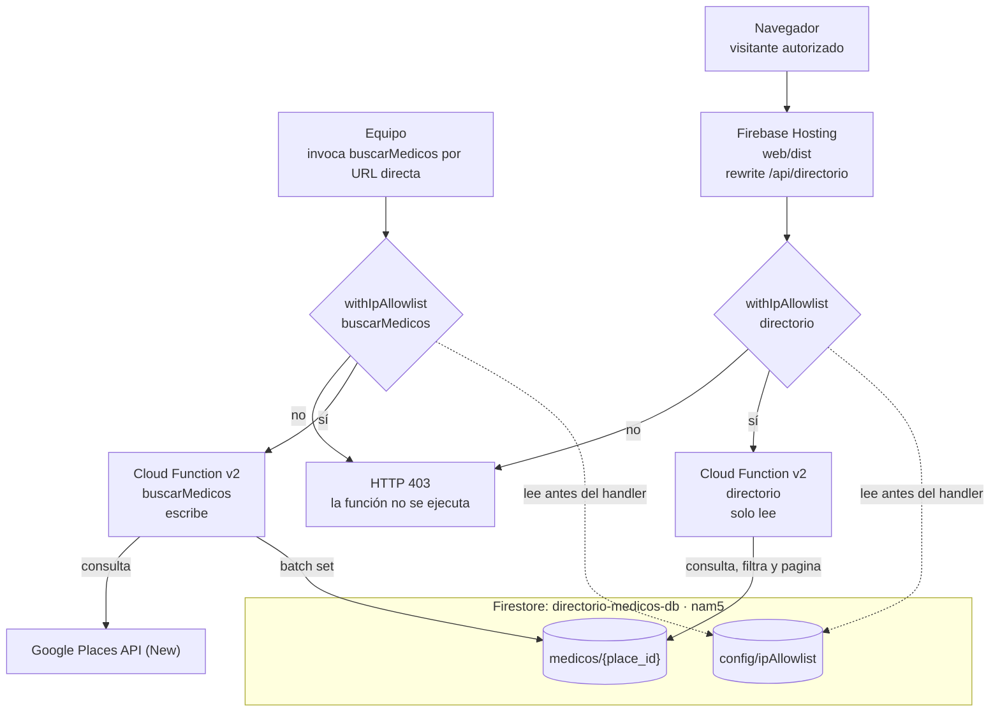

# RAI-MSPAS

Directorio de médicos especialistas para el Ministerio de Educación de Guatemala. Proyecto del curso **CC3106 Responsible AI** de la Universidad del Valle de Guatemala.

## Arquitectura actual

El sistema separa la recolección de datos de la consulta del directorio. El equipo invoca `buscarMedicos` directamente cuando necesita poblar o actualizar datos; la interfaz web solo puede consultar los registros existentes mediante `directorio`.



### Componentes y responsabilidades

- **`web/`**: aplicación React 18 con Vite. Firebase Hosting publica el contenido compilado de `web/dist`. La UI obtiene el directorio con `fetch('/api/directorio')`, descarga páginas de hasta 50 registros y realiza en el navegador la búsqueda textual, los filtros y la paginación visual de ocho tarjetas.
- **`functions/`**: Firebase Functions v2 sobre Node.js 22. `buscarMedicos` consulta Places y escribe; `directorio` consulta Firestore y expone la lectura paginada. El despliegue limita las instancias a 10.
- **`withIpAllowlist`**: middleware que envuelve cada Function HTTP. Lee `config/ipAllowlist` antes de ejecutar la lógica de negocio y devuelve `403` si la IP no está autorizada.
- **Firestore**: usa la base nombrada `directorio-medicos-db` en `nam5`. Las Functions acceden mediante `getDb()` y el Admin SDK; las reglas bloquean el acceso directo desde clientes.
- **Google Places API (New)**: solo es llamada por `buscarMedicos`. La clave `PLACES_API_KEY` permanece en el backend y nunca se entrega al navegador.

### Flujo de recolección

`buscarMedicos` recibe `keyword` y `zona`, valida que la zona tenga el formato `zona<numero>` y construye una búsqueda como:

```text
{keyword} {zona} Ciudad de Guatemala
```

La Function solicita hasta 20 resultados a Google Places, transforma los campos enriquecidos y guarda cada resultado en `medicos` usando `place_id` como ID del documento. Esto evita duplicados entre búsquedas. La ruta no se publica mediante Hosting; solo se invoca por la URL directa de Cloud Functions y está destinada al equipo.

### Flujo de consulta

1. El navegador carga los archivos estáticos desde Firebase Hosting.
2. La UI solicita `/api/directorio` al mismo dominio.
3. Hosting reescribe esa ruta hacia `directorio` en `us-central1`.
4. `withIpAllowlist` valida la IP antes de ejecutar la consulta.
5. `directorio` lee `medicos`, aplica los filtros opcionales y devuelve la página solicitada.

El rewrite mantiene el mismo origen para el navegador, por lo que la UI no necesita conocer el proyecto de Firebase ni configurar CORS. La regla `** -> /index.html` permite que React maneje el ruteo de la aplicación.

## Datos y seguridad

### Colecciones principales

| Ruta | Contenido |
| --- | --- |
| `medicos/{place_id}` | `nombre`, `direccion`, `telefono`, `sitio_web`, `especialidad`, `zona`, `place_id`, `keyword_usado`, `fecha_recoleccion`, ubicación, horarios, estado y tipos de Google. |
| `config/ipAllowlist` | `ips` como arreglo de strings y `enabled` como booleano. |

El campo `zona` conserva el parámetro usado en la búsqueda; no verifica la zona de la dirección devuelta por Google. Los datos son una referencia y no una validación de credenciales médicas.

La allowlist compara IPs completas, sin rangos CIDR, y mantiene el resultado en memoria durante 60 segundos. Si el documento no existe o no se puede leer, usa `IPS_AUTORIZADAS` como respaldo. En el emulador, `devSeed.ts` crea automáticamente una allowlist local con `127.0.0.1` y `::1`; esto no ocurre en producción.

## API

| Endpoint | Exposición | Parámetros | Respuesta |
| --- | --- | --- | --- |
| `GET /buscarMedicos` | URL directa de Cloud Functions; uso interno | `keyword` no vacío y `zona` con formato `zona<numero>` | `200` con el número de registros guardados; `400`, `403` o `500` según el caso. |
| `GET /api/directorio` | Rewrite de Firebase Hosting | `page` desde 1, `pageSize` máximo 50, `especialidad` y `zona` opcionales | `{ page, pageSize, total, data }`. `total` es la cantidad devuelta en esa página, no el total global. |

Ejemplos:

```text
/api/directorio?page=1&pageSize=50

https://us-central1-<project-id>.cloudfunctions.net/buscarMedicos?keyword=cardiologia&zona=zona10
```

## Estructura del repositorio

```text
.
├── functions/
│   ├── src/index.ts                  # buscarMedicos y directorio
│   ├── src/middleware/ipAllowlist.ts # puerta de entrada por IP
│   ├── src/firestoreDb.ts            # acceso a la base nombrada
│   ├── src/medicalPlaceData.ts       # transformación de Places
│   └── src/scripts/testAllowlist.ts  # smoke test del middleware
├── web/
│   └── src/                          # React, componentes y estilos
├── docs/
│   ├── arquitectura.md               # diagrama y explicación detallada
│   ├── runbook.md                    # setup, emulador y despliegue
│   └── estrategia-keywords.md        # búsquedas planificadas
├── evidences/                        # capturas de verificaciones y despliegues
├── firebase.json                     # Functions, Firestore, Hosting y emuladores
└── firestore.rules                   # acceso directo bloqueado
```

## Desarrollo local

Requisitos: Node.js 22, npm y Firebase CLI.

En una terminal, levantar Functions y Firestore:

```powershell
cd functions
npm install
npm run serve
```

En otra terminal, levantar la UI:

```powershell
cd web
npm install
npm run dev
```

Durante el desarrollo, Vite redirige `/api/directorio` al emulador de Functions del proyecto `demo-resp-ai` y agrega `X-Forwarded-For: 127.0.0.1` para que la allowlist local funcione. Para consultar una Function desplegada se puede definir `VITE_DIRECTORIO_API_TARGET` en `web/.env`.

Smoke test reproducible del middleware:

```powershell
cd functions
npm run test:allowlist
```

La prueba debe mostrar `403` para una IP no autorizada y una respuesta distinta de `403` para una IP autorizada. `buscarMedicos` sí consulta Google Places aunque se ejecute contra el emulador, por lo que debe invocarse de forma planificada para evitar consumo innecesario de cuota o presupuesto.

## Despliegue

Antes de desplegar en un proyecto real:

1. Confirmar el proyecto activo con `firebase use`.
2. Crear la base Firestore `directorio-medicos-db` en `nam5`.
3. Crear `config/ipAllowlist` en esa base con las IPs autorizadas y `enabled: true`.
4. Configurar `functions/.env` a partir de `functions/.env.example` con `PLACES_API_KEY`.

Desde la raíz del repositorio:

```powershell
firebase deploy --only "functions,firestore:rules,firestore:indexes"
firebase deploy --only hosting
```

Los hooks de `firebase.json` ejecutan lint y build antes de publicar Functions y Hosting. El procedimiento completo y las comprobaciones de seguridad están en [`docs/runbook.md`](docs/runbook.md).

## Limitaciones conocidas

- La UI descarga el directorio por bloques y filtra/busca en el cliente; para un crecimiento sostenido convendría mover esos filtros al servidor y reemplazar `offset` por cursores.
- La allowlist requiere IPs exactas y puede tardar hasta 60 segundos en reflejar cambios por su caché.
- Google Places puede devolver datos incompletos o una especialidad diferente de la buscada; el sistema no inventa valores faltantes.
- Antes de reutilizar los datos fuera del curso deben revisarse los términos y las reglas de atribución de Google Places API.

## Documentación relacionada

- [Arquitectura detallada](docs/arquitectura.md)
- [Runbook de configuración, pruebas y despliegue](docs/runbook.md)
- [Estrategia de keywords](docs/estrategia-keywords.md)
- [Documento técnico final](docs/doc_final.md)
- [Evidencias de implementación](docs/evidencias.md)
