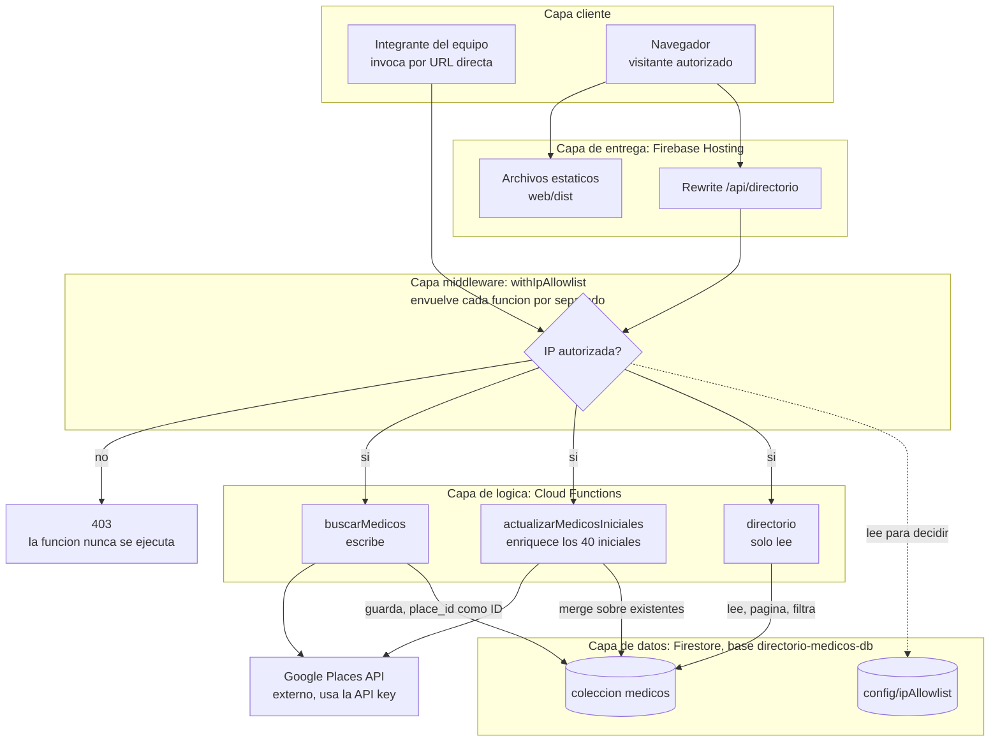

# Arquitectura del sistema

Dos flujos separados que comparten la misma base de datos, pero nunca se llaman entre sí directamente. Tres Cloud Functions, todas protegidas por el mismo middleware de allowlist.

## Flujo 1: poblar el directorio (lo corre el equipo)

Un integrante llama a `buscarMedicos` con una especialidad y una zona, siguiendo el plan de `estrategia-keywords.md`. Esa función consulta la Google Places API real y guarda los resultados en Firestore, usando el `place_id` de Google como identificador del documento para evitar duplicados.

Nadie más ejecuta este flujo, ni el frontend ni un usuario final. Es una herramienta interna, y esto no depende solo de una convención: `buscarMedicos` **no tiene ruta publicada en el sitio web**, solo se puede invocar por su URL directa de Cloud Functions.

En este mismo flujo vive `actualizarMedicosIniciales`, una migración temporal que enriquece documentos ya existentes para una lista fija de 40 `place_id` definida en `functions/src/medicalPlaceData.ts`. Consulta detalles a Places por cada ID y actualiza con `merge`, sin crear ni borrar registros. Exige método `POST` y el parámetro `?confirmar=actualizar-40` para que no se dispare por accidente desde un navegador.

## Flujo 2: consultar el directorio (lo usa la demo o cualquier visitante autorizado)

El navegador carga la UI desde Firebase Hosting y pide sus datos a `directorio`, que solo lee lo que ya está guardado en Firestore, con paginación y filtros por especialidad y zona. Esta función nunca llama a Google Places ni usa la API key.

## El rewrite de Hosting

La UI no llama a la URL de Cloud Functions. Pide `/api/directorio` **al mismo dominio desde el que se cargó**, y Firebase Hosting reescribe internamente esa ruta hacia la función. La regla vive en `firebase.json`:

```json
"rewrites": [
  { "source": "/api/directorio",
    "function": { "functionId": "directorio", "region": "us-central1" } },
  { "source": "**", "destination": "/index.html" }
]
```

Esto tiene tres consecuencias útiles:

- No hay problemas de CORS, porque para el navegador es el mismo origen.
- El frontend no necesita saber el ID del proyecto, así que el mismo código compilado funciona en el proyecto de cada integrante sin cambios.
- Solo se publica la ruta de lectura. Las dos funciones de escritura no tienen ruta en el sitio.

La segunda regla (`**` hacia `/index.html`) es la que permite que la aplicación de React maneje su propio ruteo sin que Hosting devuelva 404.

## El middleware es una puerta de entrada, no un chequeo aparte

`withIpAllowlist` envuelve cada Cloud Function (`onRequest(withIpAllowlist(handler))`) y corre antes que cualquier otra cosa. Ninguna request llega a la lógica de negocio, y por lo tanto tampoco a Firestore, sin pasar primero por ese chequeo. Si la IP no está autorizada, la función original nunca se ejecuta: no hay ningún camino que llegue a los datos rodeando el middleware.

El diagrama está organizado por capas para que esto quede explícito: cliente, entrega, middleware, lógica y datos, de arriba hacia abajo.

## Diagrama



## Notas sobre el diagrama

- `config/ipAllowlist` no es un sistema aparte. Vive en el mismo Firestore que la colección `medicos`, solo que en otra colección que únicamente lee el middleware.
- El diagrama muestra un solo nodo de middleware por claridad visual, pero en el código son tres instancias independientes, una por función. Comparten el mismo patrón y el mismo documento de configuración, no un servicio central.
- Solo `buscarMedicos` y `actualizarMedicosIniciales` hablan con Google Places, y por lo tanto son las únicas que generan costo por consulta. `directorio` se puede llamar libremente.
- El acceso a Firestore siempre pasa por `getDb()` (`functions/src/firestoreDb.ts`), que apunta explícitamente a la base con nombre `directorio-medicos-db` y no a `(default)`.

## Limitaciones conocidas

- El frontend hace una sola llamada fija (`/api/directorio?page=1&pageSize=50`) y pagina del lado del cliente. Como `directorio` además limita `pageSize` a 50, la interfaz nunca muestra más de 50 registros aunque Firestore tenga más. Es suficiente para la demo actual, pero deja de serlo si se ejecuta la campaña completa de keywords.
- La allowlist compara IPs por igualdad exacta, sin soporte de rangos CIDR. Quien tenga IP dinámica va a necesitar actualizar el documento con cierta frecuencia.
- El campo `zona` guarda el parámetro de búsqueda, no una zona verificada contra la dirección devuelta por Google. Un resultado puede quedar etiquetado en una zona distinta a la de su dirección real.
