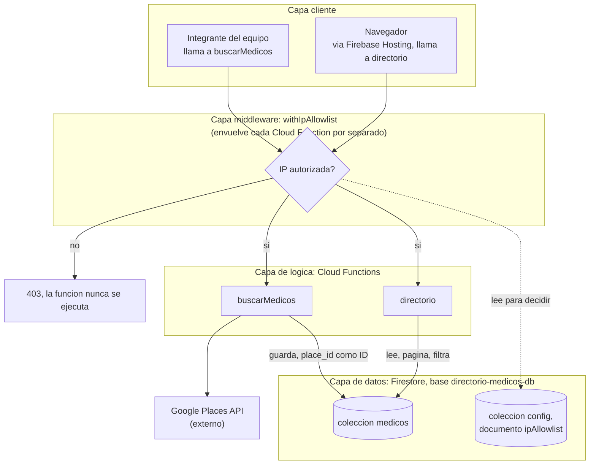

# Arquitectura del sistema

Dos flujos separados que comparten la misma base de datos, pero nunca se llaman entre sí directamente.

## Flujo 1: poblar el directorio (lo corre el equipo)

Un integrante del equipo llama a `buscarMedicos` con una especialidad y una zona, siguiendo el plan de `estrategia-keywords.md`. Esa función consulta la Google Places API real y guarda los resultados en Firestore, usando el `place_id` de Google como identificador del documento para evitar duplicados. Nadie más ejecuta este flujo, ni el frontend ni un usuario final: es una herramienta interna, protegida por el mismo allowlist de IPs.

## Flujo 2: consultar el directorio (lo usa la demo o cualquier visitante autorizado)

El navegador carga la UI (Firebase Hosting) y llama a `directorio`, que solo lee lo que ya está guardado en Firestore, con paginación y filtros por especialidad y zona. Esta función nunca llama a Google Places, solo lee la base de datos ya poblada por el flujo 1.

## El middleware es una puerta de entrada, no un chequeo aparte

`withIpAllowlist` envuelve cada Cloud Function (`onRequest(withIpAllowlist(handler))`), y corre antes que cualquier otra cosa. Ninguna request llega a la lógica de `buscarMedicos` o `directorio`, y por lo tanto tampoco a Firestore, sin pasar primero por ese chequeo. Si la IP no está autorizada, la función original nunca se ejecuta: no hay ningún camino que llegue a los datos rodeando el middleware.

El diagrama está organizado por capas para que esto quede explícito: cliente, middleware, lógica, datos, en ese orden, de arriba hacia abajo.

## Diagrama

Dos cosas que el diagrama deja claras y que antes no quedaban tan explícitas:

- `config/ipAllowlist` no es un sistema aparte, vive en el mismo Firestore que la colección `medicos`, solo que en una colección distinta que únicamente lee el middleware.
- Aunque el diagrama muestra un solo nodo de middleware por simplicidad, en el código son dos instancias independientes (una por función), no un servicio central compartido. Comparten el mismo patrón y el mismo documento de configuración, pero no hay un solo punto de falla entre ambas.

La UI nunca llama a `buscarMedicos` ni a Google Places directamente, y `buscarMedicos` nunca se dispara desde el navegador. Son dos caminos independientes que solo se cruzan en la base de datos.
