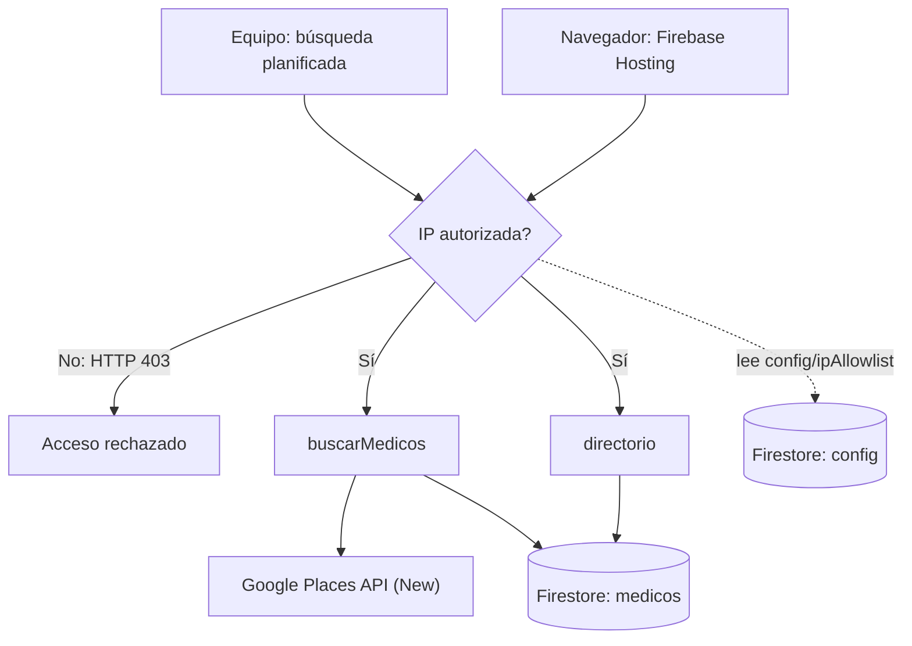

# Directorio de Médicos Especialistas

## Documentación técnica final

**Curso:** CC3106 Responsible AI · **Institución:** Universidad del Valle de Guatemala  
**Tecnología:** TypeScript, Firebase Functions v2, Firestore, Google Places API (New), React/Vite y Firebase Hosting.

## 1. Objetivo y alcance

El sistema crea un directorio académico de médicos y centros médicos de Ciudad de Guatemala. El sistema recolecta datos de Google Places, los guarda en Firestore y los muestra en una interfaz web.

El sistema no diagnostica, no recomienda y no valida credenciales médicas. Los datos sirven como referencia. Cada registro conserva su fuente y su fecha de recolección. El alcance actual cubre dos especialidades y dos zonas. Son cuatro combinaciones de búsqueda.

## 2. Arquitectura

El sistema tiene dos funciones HTTP. `buscarMedicos` recolecta datos. `directorio` consulta los datos existentes. Las dos funciones usan el mismo middleware de lista de IP permitidas (`allowlist`).



La base de datos tiene el nombre `directorio-medicos-db`. Las reglas de Firestore bloquean el acceso directo desde clientes. Las Functions usan el Admin SDK para leer y escribir los datos.

## 3. Implementación

### Recolección

`buscarMedicos` recibe `keyword` y `zona`. Construye la consulta:

```text
{keyword} {zona} Ciudad de Guatemala
```

La función solicita hasta 20 resultados por llamada. Rechaza un `keyword` vacío y una zona que no tenga el formato `zona<numero>`. Guarda los campos del enunciado: `nombre`, `especialidad`, `direccion`, `telefono`, `sitio_web`, `zona`, `place_id`, `fecha_recoleccion` y `keyword_usado`. También guarda datos enriquecidos de Places, como ubicación, horarios, estado y tipos de Google.

`place_id` es el ID del documento. Este ID evita duplicados. Si un lugar aparece en varias búsquedas, el documento se conserva una sola vez. La última búsqueda puede cambiar su especialidad, zona y `keyword_usado`.

La función histórica `actualizarMedicosIniciales` ya no forma parte del código ni del despliegue. La recolección actual guarda los campos enriquecidos en una sola llamada.

### Consulta e interfaz

`directorio` implementa `GET /directorio` con estos parámetros:

- `page` y `pageSize`; `pageSize` tiene un máximo de 50.
- `especialidad` y `zona` como filtros opcionales.

La consulta usa un índice compuesto para combinar los filtros y ordenar por `nombre`. La UI solicita páginas sucesivas de la API y muestra ocho tarjetas por página. La UI incluye búsqueda textual, filtros, modal de detalle, enlaces de contacto y estados de carga, error y acceso rechazado.

La UI no llama a Places y no lee Firestore directamente. La clave de Places permanece en el backend.

## 4. Seguridad, operación y costo

Cada Function HTTP usa `withIpAllowlist`. El middleware lee `config/ipAllowlist` antes de ejecutar la lógica de negocio. Si la IP no está en `ips`, la respuesta es HTTP 403. El campo `enabled` permite activar o desactivar el control. El middleware compara la IP completa; no acepta rangos CIDR.

La clave `PLACES_API_KEY` vive en `functions/.env`. Este archivo no se publica en Git. La clave está restringida a Places API (New). El frontend nunca recibe la clave.

El proyecto usa emuladores durante el desarrollo. El despliegue usa Functions Gen2 y limita las instancias máximas a 10. Places API tiene una cuota diaria. El proyecto también tiene alertas de presupuesto al 50% y al 90%. La función `buscarMedicos` solo genera consumo de Places cuando el equipo la invoca. La UI se publica como archivos estáticos en Firebase Hosting.

Functions Gen2 no tiene una IP de salida fija por defecto. Por esta razón, la clave de Places no usa una restricción por IP de salida. Una IP fija requeriría VPC Connector y Cloud NAT, con costo adicional no justificado para este proyecto académico.

## 5. Estrategia y calidad de los datos

El equipo definió la estrategia antes de ejecutar las búsquedas. El alcance usa estos términos sin tilde:

| Especialidad | Zona | Resultados finales |
| --- | --- | ---: |
| cardiologia | zona10 | 15 |
| cardiologia | zona1 | 13 |
| pediatria | zona10 | 18 |
| pediatria | zona1 | 20 |

Places devolvió hasta 20 resultados en cada llamada. Los conteos finales son menores en algunas combinaciones por la deduplicación con `place_id` y por la clasificación de la última búsqueda.

La revisión identificó estas limitaciones:

- Algunos resultados están fuera de Ciudad de Guatemala.
- `zona` registra el parámetro usado en la búsqueda. No verifica la zona de la dirección.
- Google puede devolver una especialidad distinta a la buscada.
- Algunos registros no tienen teléfono, sitio web, horario o ubicación.
- Algunos sitios web son redes sociales o directorios externos.

El sistema no infiere los campos que faltan. Los datos se conservan como los entrega Places.

## 6. Postura ética y límites

El sistema es una demostración académica. Un resultado de Google Places no confirma que una persona tenga una especialidad médica. El sistema no muestra diagnósticos ni realiza recomendaciones clínicas.

El proyecto limita el acceso con una allowlist, conserva la fuente de los datos y reduce las consultas con un alcance pequeño y cuotas. Para un uso real se necesitarían verificación profesional, política de privacidad, términos de uso y un proceso para corregir o retirar datos.

Antes de usar los datos fuera del curso, el equipo debe revisar las políticas de Places API, las reglas de atribución y los términos de Google Maps Platform. El proyecto no declara conformidad para uso comercial o productivo.

## 7. Verificación y evidencias

El smoke test local se ejecuta con:

```powershell
cd functions
npm run test:allowlist
```

El test debe mostrar un 403 para una IP no autorizada y una respuesta distinta de 403 para una IP autorizada. La prueba real repite el mismo control desde una red autorizada y otra no autorizada.

Las Functions, Firestore y Hosting se desplegaron en la región `us-central1`. Las capturas de billing, cuota de Places, Functions, allowlist, datos reales, Hosting y UI están organizadas en [`evidencias.md`](evidencias.md). Los archivos originales están en `evidences/`.

## 8. Reproducibilidad y despliegue

El procedimiento completo está en [`runbook.md`](runbook.md). Desde la raíz del repositorio, después de confirmar el proyecto correcto, se ejecuta:

```powershell
firebase deploy --only "functions,firestore:rules,firestore:indexes"
firebase deploy --only hosting
```

El predeploy ejecuta lint y build. Antes del despliegue se debe confirmar que existe `config/ipAllowlist` en la base `directorio-medicos-db`. Después se verifica una respuesta 200 desde una IP autorizada y una respuesta 403 desde una IP no autorizada.

## 9. Referencias

- [Instrucciones del proyecto](instrucciones_proy.md)
- [Runbook de configuración y pruebas](runbook.md)
- [Arquitectura detallada](arquitectura.md)
- [Estrategia de keywords](estrategia-keywords.md)
- [Evidencias de implementación](evidencias.md)
- [Cloud Functions for Firebase](https://firebase.google.com/docs/functions/manage-functions)
- [Firebase Hosting](https://firebase.google.com/docs/hosting/quickstart)
- [Places API (New)](https://developers.google.com/maps/documentation/places/web-service/text-search)
- [Políticas de Places API](https://developers.google.com/maps/documentation/places/web-service/policies)
