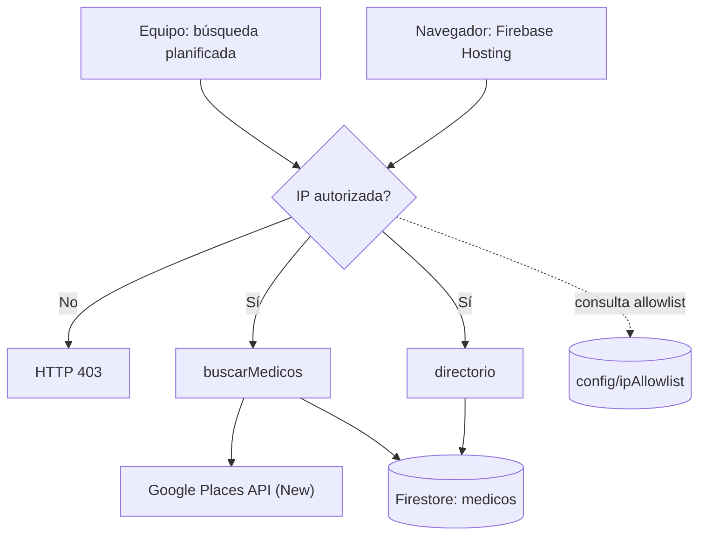

# Directorio de Médicos Especialistas

## Documentación técnica final

**Curso:** CC3106 Responsible AI · **Institución:** Universidad del Valle de Guatemala  
**Stack:** TypeScript, Firebase Functions v2, Firestore, Google Places API (New), React/Vite y Firebase Hosting.

## 1. Propósito y alcance

Nosotros construimos un directorio académico de profesionales y centros médicos de Ciudad de Guatemala. El objetivo es demostrar un flujo controlado para recolectar resultados de Google Places, organizarlos por especialidad y zona, y exponerlos en una interfaz web de consulta.

El proyecto no diagnostica, recomienda ni valida credenciales médicas. La información se presenta como referencia, con fecha y fuente de recolección. El alcance de producción se limita a pruebas finales y demostración.

## 2. Arquitectura y flujos

Planteamos dos flujos separados que se encuentran únicamente en Firestore. El flujo interno `buscarMedicos` recibe una especialidad y una zona, consulta Google Places API (New) y guarda los resultados. El flujo público autorizado carga la UI desde Firebase Hosting y consulta `directorio`; esa Function lee exclusivamente lo que ya está en Firestore y nunca expone ni utiliza la clave de Places desde el navegador.

La base configurada es **`directorio-medicos-db`**. Usamos `place_id` como ID del documento para evitar duplicados. Si un lugar aparece en distintas consultas, se conserva un único documento; la última búsqueda puede actualizar su clasificación y trazabilidad.

## 3. Implementación

`buscarMedicos` construye la consulta `{keyword} {zona} Ciudad de Guatemala`, solicita un máximo de 20 resultados y registra `keyword_usado` y `fecha_recoleccion`. Además de los campos solicitados por el enunciado —nombre, especialidad, dirección, teléfono, sitio web, zona y `place_id`— incorporamos `tipos_google`, `google_maps_url`, `ubicacion`, `fuente`, datos de contacto originales y formateados, horarios y estado del negocio.

`directorio` implementa `GET /directorio` con los parámetros `page`, `pageSize` (máximo 50), `especialidad` y `zona`. La UI obtiene hasta 50 registros mediante este endpoint y realiza la presentación por páginas de ocho tarjetas. Incluye búsqueda textual, filtros dependientes, modal de detalle, enlaces de contacto y estados de carga, error y acceso denegado.

Para enriquecer los 40 registros iniciales se agregó `actualizarMedicosIniciales`. Esta Function temporal consulta detalles por una lista fija de `place_id`, actualiza únicamente documentos existentes mediante `merge` y no crea registros nuevos.

## 4. Postura técnica

Nosotros planteamos una arquitectura serverless para evitar administrar servidores y separar claramente responsabilidades. La UI no consulta Google Places ni Firestore de forma directa: la Function `directorio` concentra la lectura, el filtrado y el control de acceso. De esta manera, la clave de Places permanece en el backend y las reglas de Firestore pueden negar el acceso directo desde clientes.

Elegimos `place_id` como identidad estable en lugar de generar IDs aleatorios, porque permite repetir búsquedas sin multiplicar registros. Usamos emuladores durante el desarrollo, `maxInstances: 10` como límite de escalamiento y Functions sin instancias mínimas reservadas, para controlar costo. También dejamos las fotografías de Places fuera del alcance actual: no son necesarias para la demostración, agregan solicitudes y requieren revisar sus políticas de visualización.

La paginación por `offset` y la carga de hasta 50 documentos para paginar ocho tarjetas en la interfaz son decisiones suficientes para el volumen de la demo. Si el directorio creciera de forma sostenida, nosotros migraríamos la API a paginación por cursor, agregaríamos índices según consultas reales y separaríamos la clasificación canónica de las coincidencias de búsqueda.
## 5. Seguridad, operación y costo

Nosotros protegemos cada Function HTTP con el middleware `withIpAllowlist`. Antes de ejecutar la lógica de negocio, el middleware consulta `config/ipAllowlist`; una IP no autorizada recibe HTTP 403. La configuración se probó tanto con el emulador como con el despliegue real desde una red autorizada y otra no autorizada.

La clave `PLACES_API_KEY` se conserva en `functions/.env` y no se publica en el repositorio ni en el frontend. Está restringida por API a Places API (New). En Functions Gen2 no configuramos una restricción por IP de salida porque no contamos con una IP estática; añadir una requeriría infraestructura adicional no justificada para el alcance académico.

También configuramos alertas de presupuesto y cuotas diarias de Places API. Trabajamos localmente con emuladores para reducir consultas externas y reservamos el despliegue real para validación y demo. Hosting publica archivos estáticos; las Functions escalan a cero cuando no reciben solicitudes y `buscarMedicos` solo genera uso de Places cuando el equipo lo invoca.

## 6. Evidencia de implementación

Las Functions y el backend fueron desplegados en `us-central1` y la interfaz se publicó con Firebase Hosting. Cada integrante mantiene su propio proyecto de GCP, por lo que existe un despliegue independiente por persona.

Las capturas que respaldan cada requisito del enunciado (alertas de billing, cuota diaria de Places, Functions desplegadas, rechazo 403 de la allowlist, datos reales en Firestore y UI publicada) están recopiladas en [`evidencias.md`](evidencias.md), organizadas por requisito y por integrante. Los archivos originales viven en `evidences/`.

## 7. Estrategia de datos y calidad

Nosotros documentamos la campaña de recolección en `docs/estrategia-keywords.md`. El alcance definido es de dos especialidades en dos zonas de Ciudad de Guatemala, cuatro combinaciones en total, que producen más de cincuenta registros únicos.

Ese alcance es una decisión deliberada y no un plan incompleto. Una propuesta inicial más amplia habría generado del orden de ochocientos a mil doscientos registros, un volumen que vuelve imposible la revisión manual de relevancia que pide el enunciado, contradice el control de costo que el propio proyecto establece con cuotas y alertas, y excede por mucho lo que la interfaz puede mostrar. Preferimos un conjunto acotado y revisado sobre uno extenso y sin verificar. El sistema acepta cualquier combinación sin cambios de código, por lo que ampliar la cobertura es una decisión operativa y no un desarrollo pendiente.

La trazabilidad se conserva con `fuente`, `keyword_usado`, `fecha_recoleccion` y `actualizado_en`. Los valores ausentes no se infieren: teléfono, sitio web, horario o ubicación pueden quedar vacíos cuando Places no los proporciona. La revisión del conjunto recolectado dejó hallazgos documentados en la estrategia: resultados fuera de Ciudad de Guatemala, un campo `zona` que refleja el parámetro de búsqueda y no la dirección verificada, especialidades cruzadas por la nomenclatura inconsistente de Google Maps, y sitios web que apuntan a redes sociales o directorios externos en lugar de a una clínica. Ninguno de esos casos se corrigió ni se rellenó.

## 8. Postura ética y límites

Nosotros planteamos este sistema como una demostración académica y no como un directorio médico certificador. No inferimos diagnósticos, calidad clínica, disponibilidad, precios, aceptación de seguros ni credenciales profesionales. Una coincidencia en Google Places no equivale a validar a una persona como especialista.

Mostramos la fuente y la trazabilidad de cada registro, limitamos el acceso mediante allowlist y minimizamos el uso de la API con cuotas, piloto y búsquedas planificadas. En producción se debería añadir un proceso de verificación profesional, política de privacidad, términos de uso y un mecanismo para corregir o retirar información desactualizada.

Google Places impone políticas de visualización, atribución y almacenamiento de sus datos. Por ello, antes de un uso fuera del curso revisaríamos las [políticas de Places API](https://developers.google.com/maps/documentation/places/web-service/policies) y los [términos de Google Maps Platform](https://cloud.google.com/maps-platform/terms), validaríamos la retención permitida y agregaríamos la atribución requerida por Google. El proyecto actual no declara conformidad para un uso comercial o productivo.

## 9. Reproducibilidad y despliegue

El procedimiento completo de setup, emuladores y Functions está en `docs/runbook.md`. La interfaz, contrato de datos, migración de los 40 registros y despliegue exclusivo de Hosting se documentan en `docs/ui-directorio.md`.

Para publicar un cambio visual desde la raíz del repositorio se ejecuta `firebase deploy --only hosting`. El predeploy corre automáticamente el lint y build de `web/`; no vuelve a desplegar Functions ni consulta Google Places. Después se valida la UI desde una IP autorizada y se confirma el rechazo desde una red no incluida en la allowlist.

## 10. Referencias

### Documentación del proyecto

- [Instrucciones del proyecto](instrucciones_proy.md)
- [Runbook de configuración y pruebas](runbook.md)
- [Arquitectura detallada](arquitectura.md)
- [Estrategia de keywords](estrategia-keywords.md)
- [UI, contrato de datos y Hosting](ui-directorio.md)
- [Evidencias de implementación](evidencias.md)

### Documentación oficial

- [Cloud Functions for Firebase: administrar Functions](https://firebase.google.com/docs/functions/manage-functions)
- [Firebase Hosting: primeros pasos](https://firebase.google.com/docs/hosting/quickstart)
- [Precios de Firebase](https://firebase.google.com/pricing)
- [Precios de Cloud Firestore](https://cloud.google.com/firestore/pricing)
- [Places API (New): búsqueda de texto](https://developers.google.com/maps/documentation/places/web-service/text-search)
- [Places API: políticas y atribuciones](https://developers.google.com/maps/documentation/places/web-service/policies)
- [Términos de Google Maps Platform](https://cloud.google.com/maps-platform/terms)
